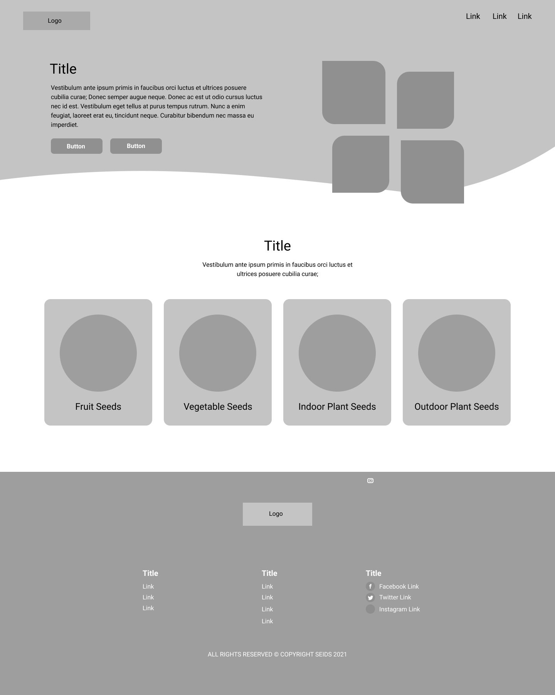
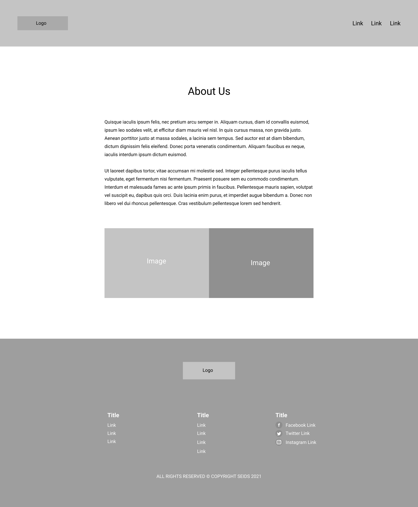
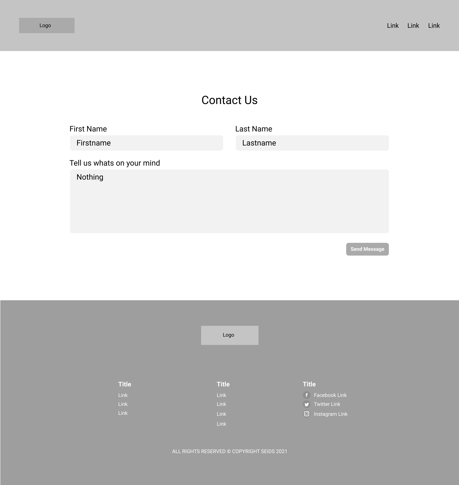
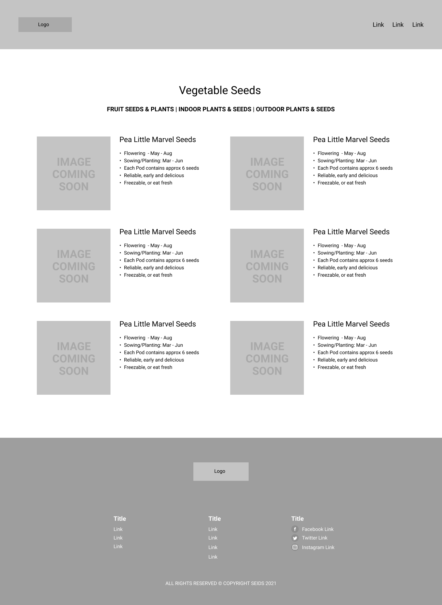

# Seids
&nbsp;

The name ‘Seids’ comes from knowing each seed we plant carries their own identity with their shape, colour and flavour therefore creating an ID for each. This is where ‘Seeds’ became ‘Seids’.

Seids primary goal is provide information and key rules when planting seeds for indoor and outdoor plants out as well as edible plants such as strawberry and tomato plants. It contains simple but useful information for both beginners and well established gardeners needing some refreshing advice. Throughout the site it provides easy to view sections whereby the user can interact and note down essential step by step tasks as well l as following other useful links to social media platforms to see if other seed enthusiasts have any additional info from a personal stand point to help with any personal queries on seeds.

&nbsp;

&nbsp;

In everyday situations you find yourself trying to save money somewhere. This website helps people grow and eat healthy foods for less in a convenient way with a step by step process to help with each type of seed should you need it. The colour scheme through the site is the colours of a plant; a green top to represent leaves with a plain white middle for the essential content and a brown footer to represent the soil which plants grow from. I picked the primary colours from a RGB selector tool and the other variations of the colours come from those two colours. The greens HEX is #53BF9F and the brown is #725647 meaning enough colour contrast between the two elements when scrolling down a short page. You can also see from the image provided the different outcomes on multiple device screen sizes.

<h3>Responsive and Desktop Views<h3>
    
    
    
    

&nbsp;
  <h3>User Stories</h3>
   
<i>User One - A new visitor looking for key information from Google 
User Two - A regular visitor looking to add another seed into their collection 
  User Three - Someone who wants to know more info from Seids using the Contact Page</i>

  <h4>User One:</h4>
  <li>Googles ‘Help with Strawberry seeds’</li>
  <li>Seids appears on the first page displaying information that person wants to read </li>
  <li>Clicks onto the website and takes you to the ‘Seed Information Page’ </li>
<li>Once read user one wonders whether we have information on another seed he wants in the future</li>
  <li>Clicks the link back to the main page displaying those type of seeds.</li>
<li>Scrolls through to select new seed to look at</li>
  <li>Clicks on relevant seed and the new page displays the information</li>

  <h4>User Two:</h4>
<li>Types in the URL from using the website the previous day to see if anything changed or added to the ‘Seeds Information Page’</li>
<li>When loaded they click the button ‘Choose Seeds’ located in the header section of the website</li>
<li>When clicked it loads the types of seeds to pick from </li>
<li>Chooses their type of seeds they want to look at and takes you to that section of the website</li>
<li>User two finds their desired information on a seed and leaves the site</li>

<h4>User Three:</h4>
  <li>Types in the URL of the website </li>
<li>When loaded they can clearly see the navigation links in the top right and can see a ‘Contact Us’ link</li>
<li>Clicks the link which takes them to a page dedicated to a form in which they can input anything they wish to say to Seids.</li>
<li>Once typed out the green button below is clicked and the message arrives to the inbox of websites URL</li>
  <li>User three now leaves the website knowing it has sent across successfully</li>
  &nbsp;
  

  &nbsp;
  <h3>Languages and Technology</h3>
  <h4>Programming Languages</h4>
  <li>HTML</li>
  <li>CSS</li>
  <h4>Technology</h4>
  <li>Github</li>
  <li>Figma</li>
  <li>Google Chrome Developer Tools</li>
  <h4>Third Party Sites Used</h4>
  <li><a href="http://flaticon.com">Flaticon</a></li>
  <li><a href="http://fonts.google.com">Google Fonts</a></li>
  <li><a href="http://unsplash.com">Unsplash</a></li>
  &nbsp;
  <h3>Validator Tests<h3>
    <h4>HTML</h4>
    <li><a href="#"></li>
    <li><a href="#"></li>
     <li><a href="#"></li>
     <li><a href="#"></li>
       <h4>CSS</h4>
    <li><a href="#"></li>
    <li><a href="#"></li>
     <li><a href="#"></li>
     <li><a href="#"></li>

       
       
       
       
       
       
       
       
       
       
       
       
