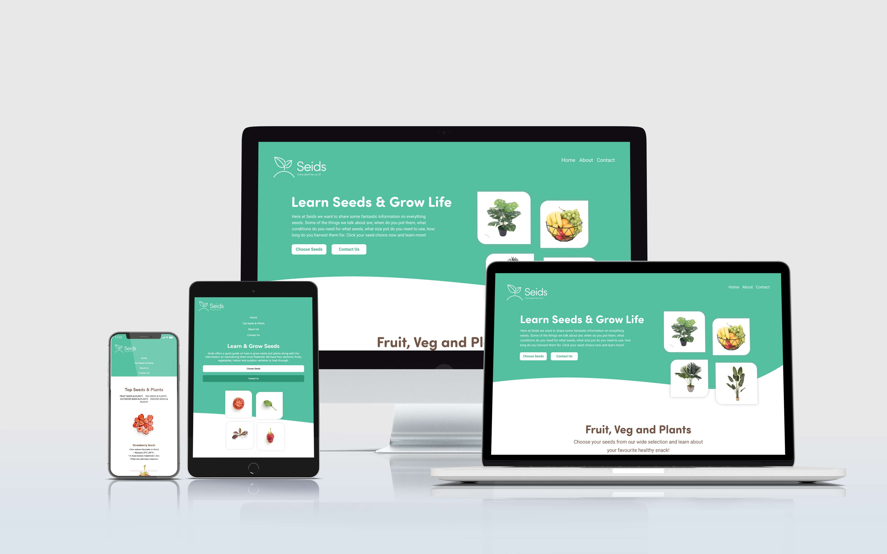
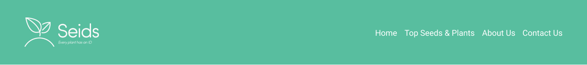
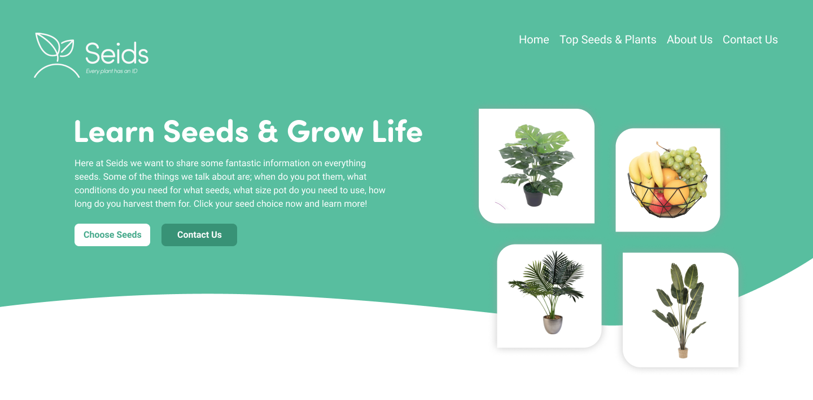
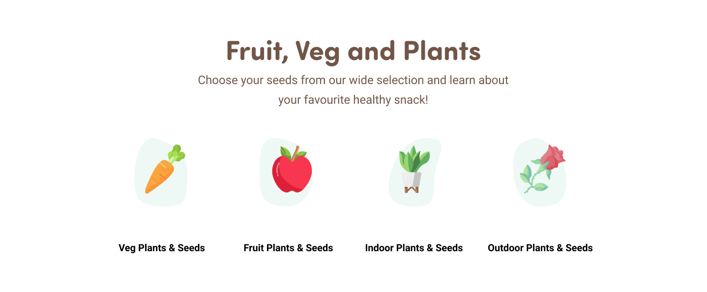
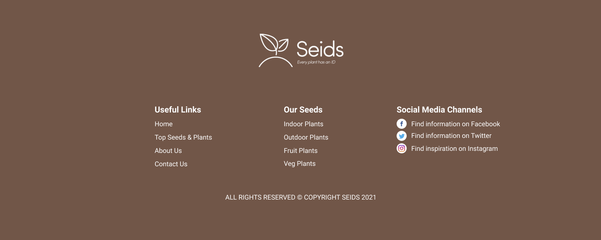
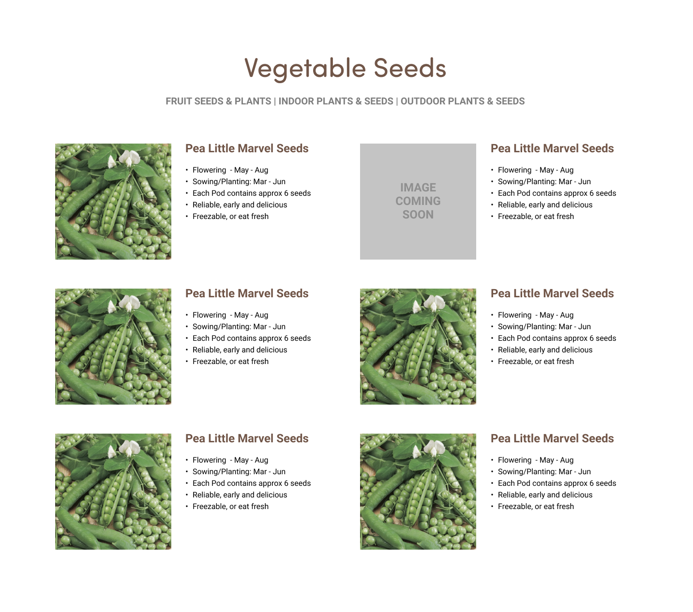
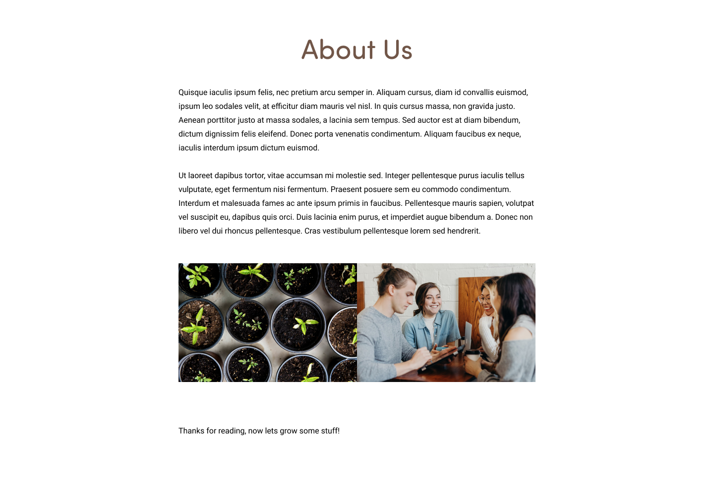

# Seids
&nbsp;

The name ‘Seids’ comes from knowing each seed we plant carries their own identity with their shape, colour and flavour therefore creating an ID for each. This is where ‘Seeds’ became ‘Seids’.

Seids primary goal is provide key bullet points when planting seeds or plants inside or outside. These include edible plants such as strawberry and tomato plants or even snake plants or cheese plants as examples. It contains simple but useful information for both beginners and well established gardeners needing some quick key info for plants. Throughout the site it provides easy to view sections whereby the user can interact and note down essential step by step tasks as well as following other useful links to social media platforms to see if other seed enthusiasts have any additional info from a personal stand point to help with any personal queries on seeds or plants

The colour scheme through the site is the colours of a plant; a green top to represent leaves with a plain white middle for the essential content and a brown footer to represent the soil which plants grow from. I picked the primary colours from a RGB selector tool and the other variations of the colours come from those two colours. The greens HEX is #53BF9F and the brown is #725647 meaning enough colour contrast between the two elements when scrolling down a short page. You can also see from the image provided the different outcomes on multiple device screen sizes.

  
<h3>Link to Deployed Website</h3>

<a href="https://tomw2810.github.io/seids-project-1/">Seids</a>
   
   

<h3>Responsive and Desktop Views<h3>
    
    
    
    

&nbsp;
  <h3>User Stories</h3>
   
<i>User One - A new visitor looking for key information from Google 
User Two - A regular visitor looking to add another seed into their collection 
  User Three - Someone who wants to know more info from Seids using the Contact Page</i>

  <h4>User One:</h4>
  <li>Googles ‘Help with Strawberry seeds’</li>
  <li>Seids appears on the first page displaying information that person wants to read </li>
  <li>Clicks onto the website and takes you to the ‘Top Seeds & Plants’ page where the relevant content is nested</li>
<li>Once read, the user one wonders whether we have information on another seed he wants in the future</li>
  <li>Clicks the link of the relevant seed or plant to the page displaying a certain criteria of their choosing</li>
<li>Scrolls through to select new seed or plant to look at</li>
  <li>Clicks on relevant seed or plant and the new page displays the information</li>

  <h4>User Two:</h4>
<li>Types in the URL from using the website the previous day to see if anything changed or added to the ‘Seeds Information Page’</li>
<li>When loaded they click the button ‘Choose Seeds’ located in the header section of the website</li>
<li>When clicked it loads the types of seeds or plants to pick from</li>
<li>Chooses their type of seeds they want to look at and takes you to that section of the website</li>
<li>User two finds their desired information on a seed and leaves the site</li>

<h4>User Three:</h4>
  <li>Types in the URL of the website </li>
<li>When loaded they can clearly see the navigation links in the top right and can see a ‘Contact Us’ link</li>
<li>Clicks the link which takes them to a page dedicated to a form in which they can input anything they wish to say to Seids.</li>
<li>Once typed out the green button below is clicked and the message arrives to the inbox of websites URL</li>
  <li>User three now leaves the website knowing it has sent across successfully</li>
  &nbsp;
  

  &nbsp;
  <h3>Sections:</h3>

<h4>Navigation Section</h4>

The nav element is a primary section and features on all pages in order for the user to go from page to page. It consists of the logo and links in order to identify the website and navigate from A to B depending on what the user intends to do. After I planned to develop a nav bar with three links I decided that it needed a fourth link to to show a popular variety of seeds and plants. This is mainly due to if the site were to expand in size this page would come in handy for many to view other top hits.

  

 <h4>Header/Hero Section</h4>

The header/hero section allows the users to clearly identify what the website is all about. In the header description area we have the title of ‘Learn Seeds & Grow Life’ which a user can quickly realise that the website is about seeds and growing life which in this case is plants. The title is accompanied by a paragraph giving the user a brief description about what the site provides throughout. Below we have two buttons; one primary button and one secondary button. These differentiate between importance for the user and the primary button is filled showcasing that this is the more important button to click on. To the right of the header description area we have an image of 4 varieties of plants showcasing what a user can achieve by following the steps on the website.

    
  
<h4>Seed/Plants Selection</h4>

In the selection area we have 4 images with titles. These are links which a user can click or tap on to take you to the relevant page of which they want. It consists of a title, small description and 4 cards to pick from. The cards also use illustrations from an external source which is listed below. Behind the image is a small rounded shape which makes the images pop and pushes towards the user for interaction should they wish.

  

<h4>Footer Section</h4>

In the footer we have a logo to either identify the website again or for use as a quick link to the top of the homepage. Below the logo we have three useful links sections where we give the user a variety of links to help navigate after reading through the websites current page. The links cover all the main links through the homepage and also include social media links. As a small company these links can help generate interest through external websites to promote products and interact with loyal seed lovers to help choose and grow their desired plant or plants.

  

<h4>Seeds & Plants Section</h4>

On the seeds info and guide page it displays a variety of seeds with the key info about each seed. When the user lands on this page they can can clearly see the seeds laid out in a two by two grid for easy reading and viewing to the eyes. with a two by two grid it can be broken down into mobile fairly easily. After I designed the page and started doing some userbility testing I quickly realised it needed something on the page to navigate to the other types of seeds and plants, this was something that I completely overlooked until it was in testing stage so the links below the title were added for ease of use throughout the pages and works well.
  

<h4>About Us Section</h4>

In the about section we have a short paragraph briefly explaining the birth of the website and goals with some pictures of the things we talk about on the site as well as a team photo of everyone working happily discussing things.

   
   
  
  <h4>Contact Section</h4>
  
Here we have a basic contact form in order for anyone who has queries or concerns about the info provided on the website Seids

  &nbsp;
 

  &nbsp;
<h3>Future Enhancements and Improvement of Features:</h3>

In time this site can become a live e-commerce website with buying and selling becoming its primary feature alongside providing key information on choosing and growing plants. It can also include how to videos by well known plant experts from around the world showing users the types of plants from different climates. Also the one page of seeds can become a more in depth with individual pages for each seed along with its needs and requirements. 

I would also like to add something more interactive to make it more fun to use, its just choosing the right type of addition to make this happen in a logical but fun way. Last but not least I would add social media accounts because they would play a massive role in showcasing the information and products so that potential new users of the site would know what to expect when visiting the site either for the first time or for the twentieth time. 

  
  &nbsp;
  

  &nbsp;
  <h3>External Links for Image Usage</h3>
  
  <h4>Header Image #1</h4>

Sourced from unsplash.com 
By Mockup Graphics 
<a href="https://unsplash.com/photos/sgmS2e95QO0">Link to Photo</a>

<h4>Header Image #2</h4>

Sourced from unsplash.com 
By Mockup Graphics 
<a href="https://unsplash.com/photos/jHcKq383ibg">Link to Photo</a>

<h4>Header Image #3</h4>

Sourced from unsplash.com 
By Mockup Graphics 
<a href="https://unsplash.com/photos/75AiRF5xm0U">Link to Photo</a>

<h4>Header Image #4</h4>

Sourced from unsplash.com 
By Mockup Graphics 
<a href="https://unsplash.com/photos/bSaBd5RK4kA">Link to Photo</a>

 

------

<h4>Veg Page Image 1</h4>

Sourced from unsplash.com 
By Mockup Graphics 
<a href="https://unsplash.com/photos/YXx2cabK4Jg">Link to Photo</a>

<h4>Veg Page Image 2</h4>

Sourced from unsplash.com 
By Mockup Graphics 
<a href="https://unsplash.com/photos/l55IGtwI8mI">Link to Photo</a>

<h4>Veg Page Image 3</h4>

Sourced from unsplash.com 
By Mockup Graphics 
<a href="https://unsplash.com/photos/6PG3k3_SRHU">Link to Photo</a>

<h4>Veg Page Image 4</h4>
  
Sourced from unsplash.com 
By Mockup Graphics 
<a href="https://unsplash.com/photos/iBW28FXHAxg">Link to Photo</a>

—————

<h4>Fruits Page Image 1</h4>

Sourced from unsplash.com 
By Mockup Graphics 
<a href="https://unsplash.com/photos/RLbly_gGSCA">Link to Photo</a>

<h4>Fruits Page Image 2</h4>

Sourced from unsplash.com 
By Mockup Graphics 
<a href="https://unsplash.com/photos/-D6xO2LUVdk">Link to Photo</a>

<h4>Fruits Page Image 3</h4>

Sourced from unsplash.com 
By Mockup Graphics 
<a href="https://unsplash.com/photos/02mYQkbBzxo">Link to Photo</a>

<h4>Fruits Page Image 4</h4>

Sourced from unsplash.com 
By Mockup Graphics 
<a href="https://unsplash.com/photos/jHcKq383ibg">Link to Photo</a>

————-

<h4>About Page Image #1</h4>

Sourced from unsplash.com 
By Markus Spiske 
  <a href="https://unsplash.com/photos/4PG6wLlVag4">Link to Photo</a>

<h4>About Page Image #2</h4>

Sourced from unsplash.com 
By Brooke Cagle  
  <a href="https://unsplash.com/photos/-uHVRvDr7pg">Link to Photo</a>

  —————

<h4>Indoor Plants Page Image 1</h4>

Sourced from unsplash.com 
By Severin Candrian 
<a href="https://unsplash.com/photos/rGdSwVibhiQ">Link to Photo</a>

<h4>Indoor Plants Page Image 2</h4>

Sourced from unsplash.com 
By Kara Eads 
<a href="https://unsplash.com/photos/nvo7jmzDDew">Link to Photo</a>

<h4>Indoor Plants Page Image 3</h4>

Sourced from unsplash.com 
By Scott Webb 
<a href="https://unsplash.com/photos/d8m_1c3MAdI">Link to Photo</a>

<h4>Indoor Plants Page Image 4</h4>

Sourced from unsplash.com 
By Sanni Sahil 
<a href="https://unsplash.com/photos/DoxGtpAsdYY">Link to Photo</a>

 —————

<h4>Outdoor Plants Page Image 1</h4>

Sourced from unsplash.com 
By Katriona McCarthy 
<a href="https://unsplash.com/photos/3uXRJo-uAPo">Link to Photo</a>

<h4>Outoor Plants Page Image 2</h4>

Sourced from unsplash.com 
By Aleksandr Kadykov 
<a href="https://unsplash.com/photos/2KMpCBrEhPQ">Link to Photo</a>

<h4>Outoor Plants Page Image 3</h4>

Sourced from unsplash.com 
By Aggie Marder 
<a href="https://unsplash.com/photos/hOy8S93cM8E">Link to Photo</a>

<h4>Outoor Plants Page Image 4</h4>

Sourced from unsplash.com 
By Jason Leung 
<a href="https://unsplash.com/photos/rHSxv7aRrVc">Link to Photo</a>

  &nbsp;
  

  &nbsp;

  <h3>Languages and Technology</h3>
  <h4>Programming Languages</h4>
  <li>HTML</li>
  <li>CSS</li>
  <h4>Technology</h4>
  <li>Github</li>
  <li>Figma</li>
  <li>Google Chrome Developer Tools</li>
  <h4>Third Party Sites Used</h4>
  <li><a href="http://flaticon.com">Flaticon</a></li>
  <li><a href="http://fonts.google.com">Google Fonts</a></li>
  <li><a href="http://unsplash.com">Unsplash</a></li>
  &nbsp;
  <h3>Validator Tests<h3>
  <h4>HTML</h4>
  <li>Index - No Issues Found</li>
  <li>Seeds Pages - No Issues Found</li>
  <li>About Page - No Issues Found</li>
  <li>Contact Us Page - No Issues Found</li>

  <h4>CSS</h4>
  
Shorthand of 'flex' not a valid declaration, this was used 6 times as it was something I knew you could do but unaware of it being wrong in the validation process. I used 'flex: row wrap;' and it should be 'flex-wrap: wrap;' with 'flex-direction: row;' This has now changed passed the validation process.

  
Accidentally left an 'auto' next to my viewport height for the headers background image. This is now removed and passes the validation

  
 

  
  <h3>Bugs & Fixes</h3>
  <h4>Issue with Image on Header</h4>
  
After being told I couldnt use bootstrap I was very anxious to see how easy or hard the coding would be without it. The first bug found was that the image on the header was not placed within the div in a way which it could respond how I thought it would. I tried using its own container as well just adding the code inside the container to the left but I cant get it to act the way I would like and essentially should. The media queries for this also caused an issue because I was using percentages and I wasn't fully confident with what i was typing. The code that had been written was not able to stack the content as intended so I asked about what I could do and got told about flex and flexbox to which I had to implement it all across the site to make it work as best as I could. The fix still isnt perfect with the header image not centering properly with the content on smaller devices but it is now much more desirable than before to a user.
     
  <h4>Image Size on About Page</h4>
  
When I initially uploaded the images for this project I thought that the images could be cropped and fitted correctly forgetting there isnt a declaration like background-image and centering the image. This caused me to have to upload a new image and crop it ready for the space intended. It now has dimensions which work for the content.
     
  <h4>Github and Gitpages</h4>
  
When I had completed the project I wanted to make sure the site was going to work for public use and therefore found the link to the site. Unfortunately the styling was missing from the website completely. It showed the content from the html pages but nothing from the css pages. I contacted a tutor on how to fix it after I couldnt find an answer from Google or from Slack. The tutor pointed out that they run file paths slightly different which I wasnt aware of. I removed the ../ from the file paths for the images and CSS files and it finally worked.
  

    
  <h3>Lighthouse Accesibilty</h3>
  <li>Performance - 81</li>
  <li>Accessibility - 97</li>
  <li>Best Practices - 93</li>
  <li>SEO - 77</li>
  
 
  

 
  <h3>Acknowledgements</h3>
  <h4>Leah Fisher</h4>
  
Looking at leahs README.md I was able to understand more about what was meant to go on the document and realised it was a bit more in depth than what I first intially thought. So I thank her document for the appropriate help.

  <h4>Code Institute Tutors</h4>
  
When I had a problem with my file paths they were quick and efficient in telling me the resolution to my issue and stayed online to make sure they worked before leaving the chat.
  <h4>W3Schools</h4>
  
Section on Flexbox was used to quickly understand certain rules for desktop and mobile layouts

   

  
  <h3>Manual Testing</h3>
  <li>Mobile 320px</li>
  <li>Mobile 375px</li>
  <li>Mobile 425px</li>
  <li>Tablet 768px</li>
  <li>Laptop 1020px</li>
       
       
       
       
       
       
       
       
       
       
