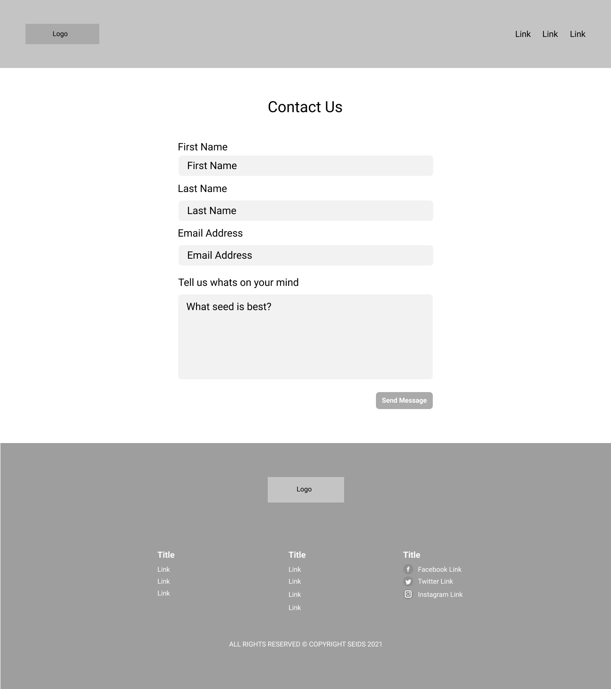

# Seids
&nbsp;

The name ‘Seids’ comes from knowing each seed we plant carries their own identity with their shape, colour and flavour therefore creating an ID for each. This is where ‘Seeds’ became ‘Seids’.

Seids primary goal is provide information and key rules when planting seeds for indoor and outdoor plants out as well as edible plants such as strawberry and tomato plants. It contains simple but useful information for both beginners and well established gardeners needing some refreshing advice. Throughout the site it provides easy to view sections whereby the user can interact and note down essential step by step tasks as well l as following other useful links to social media platforms to see if other seed enthusiasts have any additional info from a personal stand point to help with any personal queries on seeds.

In everyday situations you find yourself trying to save money somewhere. This website helps people grow and eat healthy foods for less in a convenient way with a step by step process to help with each type of seed should you need it. The colour scheme through the site is the colours of a plant; a green top to represent leaves with a plain white middle for the essential content and a brown footer to represent the soil which plants grow from. I picked the primary colours from a RGB selector tool and the other variations of the colours come from those two colours. The greens HEX is #53BF9F and the brown is #725647 meaning enough colour contrast between the two elements when scrolling down a short page. You can also see from the image provided the different outcomes on multiple device screen sizes.

<h3>Responsive and Desktop Views<h3>
    
    
    
    

&nbsp;
  <h3>User Stories</h3>
   
<i>User One - A new visitor looking for key information from Google 
User Two - A regular visitor looking to add another seed into their collection 
  User Three - Someone who wants to know more info from Seids using the Contact Page</i>

  <h4>User One:</h4>
  <li>Googles ‘Help with Strawberry seeds’</li>
  <li>Seids appears on the first page displaying information that person wants to read </li>
  <li>Clicks onto the website and takes you to the ‘Seed Information Page’ </li>
<li>Once read user one wonders whether we have information on another seed he wants in the future</li>
  <li>Clicks the link back to the main page displaying those type of seeds.</li>
<li>Scrolls through to select new seed to look at</li>
  <li>Clicks on relevant seed and the new page displays the information</li>

  <h4>User Two:</h4>
<li>Types in the URL from using the website the previous day to see if anything changed or added to the ‘Seeds Information Page’</li>
<li>When loaded they click the button ‘Choose Seeds’ located in the header section of the website</li>
<li>When clicked it loads the types of seeds to pick from </li>
<li>Chooses their type of seeds they want to look at and takes you to that section of the website</li>
<li>User two finds their desired information on a seed and leaves the site</li>

<h4>User Three:</h4>
  <li>Types in the URL of the website </li>
<li>When loaded they can clearly see the navigation links in the top right and can see a ‘Contact Us’ link</li>
<li>Clicks the link which takes them to a page dedicated to a form in which they can input anything they wish to say to Seids.</li>
<li>Once typed out the green button below is clicked and the message arrives to the inbox of websites URL</li>
  <li>User three now leaves the website knowing it has sent across successfully</li>
  &nbsp;
  

  &nbsp;
  <h3>Sections:</h3>

<h4>Navigation Section</h4>

The nav element is a primary section and features on all pages in order for the user to go from page to page. It consists of the logo and links in order to identify the website and navigate from A to B depending on what the user intends to do.

 <h4>Header/Hero Section</h4>

The header/hero section allows the users to clearly identify what the website is all about. In the header description area we have the title of ‘Learn Seeds & Grow Life’ which a user can quickly realise that the website is about seeds and growing life which in this case is plants. The title is accompanied by a paragraph giving the user a brief description about what the site provides throughout. Below we have two buttons; one primary button and one secondary button. These differentiate between importance for the user and the primary button is filled showcasing that this is the more important button to click on. To the right of the header description area we have an image of 4 varieties of plants showcasing what a user can achieve by following the steps on the website.

  
<h4>Seed Selection</h4>

In the selection area we have 4 images with titles. These are links which a user can click or tap on to take you to the relevant page of which they want. It consists of a title, small description and 4 cards to pick from. The cards also use illustrations from an external source which is listed below. Behind the image is a small rounded shape which makes the images pop and pushes towards the user for interaction should they wish.

<h4>Extra Info Section</h4>

In the extra info section we also have a rounded shape as a background. Its purpose is to give a small piece of important advice that could change from time to time depending on the season. Its something extra for the user but carries extra information which again will help with user experience. 

<h4>Footer Section</h4>

In the footer we have a logo to either identify the website again or for use as a quick link to the top of the homepage. Below the logo we have three useful links sections where we give the user a variety of links to help navigate after reading through the websites current page. The links cover all the main links through the homepage and also include social media links. As a small company these links can help generate interest through external websites to promote products and interact with loyal seed lovers to help choose and grow their desired plant or plants.

<h4>Seeds Info and Guide Section</h4>

On the seeds info and guide page it displays a variety of seeds with the key info about each seed. When the user lands on this page they can can clearly see the seeds laid out in a two by two grid for ease of use also making the responsive look into mobile is 

<h4>About Us Section</h4>

In the about section we have a short paragraph briefly explaining the birth of the website and goals.

  
  <h4>Contact Section</h4>
  
Here we have a basic contact form in order for anyone who has queries or concerns about the info provided on the website Seids

  &nbsp;
 

  &nbsp;
<h3>Future Enhancements and Improvement of Features:</h3>

In time this site can become a live e-commerce website with buying and selling becoming its primary feature alongside providing key information on choosing and growing plants. It can also include how to videos by well known plant experts from around the world showing users the types of plants from different climates. Also the one page of seeds can become a more in depth with individual pages for each seed along with its needs and requirements. 

  

I would also like to add something more interactive to make it more fun to use, its just choosing the right type of addition to make this happen in a logical but fun way. Last but not least I would add social media accounts because they would play a massive role in showcasing the information and products so that potential new users of the site would know what to expect when visiting the site either for the first time or for the twentieth time. 

  
  &nbsp;
  

  &nbsp;
  <3>External Links for Image Usage</h3>
  <h4>Header Image #1</h4>

Sourced from: https://unsplash.com 
By Mockup Graphics 

<h4>Header Image #2</h4>

Sourced from: https://unsplash.com 
By Mockup Graphics 

<h4>Header Image #3</h4>

Sourced from: https://unsplash.com 
By Mockup Graphics 

<h4>Header Image #4</h4>

Sourced from: https://unsplash.com 
By Mockup Graphics 

 

<h4>Veg Seeds Page Image 1</h4>

Sourced from: https://unsplash.com 
By Mockup Graphics 

<h4>Veg Seeds Page Image 2</h4>

Sourced from: https://unsplash.com 
By Mockup Graphics 

<h4>Veg Seeds Page Image 3</h4>

Sourced from: https://unsplash.com 
By Mockup Graphics 

<h4>Veg Seeds Page Image 4</h4>
  
Sourced from:  
By Mockup Graphics 
<a href=“https://unsplash.com/photos/l55IGtwI8mI”>Link to Photo</a>

—————

<h4>Fruit Seeds Page Image 1</h4>

Sourced from: https://unsplash.com 
By Mockup Graphics 

<h4>Fruit Seeds Page Image 2</h4>

Sourced from: https://unsplash.com 
By Mockup Graphics 

<h4>Fruit Seeds Page Image 3</h4>

Sourced from: https://unsplash.com 
By Mockup Graphics 

<h4>Fruit Seeds Page Image 4</h4>

Sourced from: https://unsplash.com 
By Mockup Graphics 
<a href=“https://unsplash.com/photos/xIfhcoVwAjc”>Link to Photo</a>

<h4>About Page Image #1</h4>

Sourced from: https://unsplash.com 
By Markus Spiske 
  

<h4>About Page Image #2</h4>

Sourced from: https://unsplash.com 
By Hush Naidoo Jade Photograghy  
  

  &nbsp;
  

  &nbsp;

  <h3>Languages and Technology</h3>
  <h4>Programming Languages</h4>
  <li>HTML</li>
  <li>CSS</li>
  <h4>Technology</h4>
  <li>Github</li>
  <li>Figma</li>
  <li>Google Chrome Developer Tools</li>
  <h4>Third Party Sites Used</h4>
  <li><a href="http://flaticon.com">Flaticon</a></li>
  <li><a href="http://fonts.google.com">Google Fonts</a></li>
  <li><a href="http://unsplash.com">Unsplash</a></li>
  &nbsp;
  <h3>Validator Tests<h3>
    <h4>HTML</h4>
    <li><a href="#"></li>
    <li><a href="#"></li>
     <li><a href="#"></li>
     <li><a href="#"></li>
       <h4>CSS</h4>
    <li><a href="#"></li>
    <li><a href="#"></li>
     <li><a href="#"></li>
     <li><a href="#"></li>

       
       
       
       
       
       
       
       
       
       
       
       
